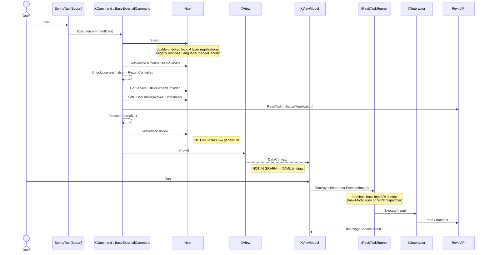
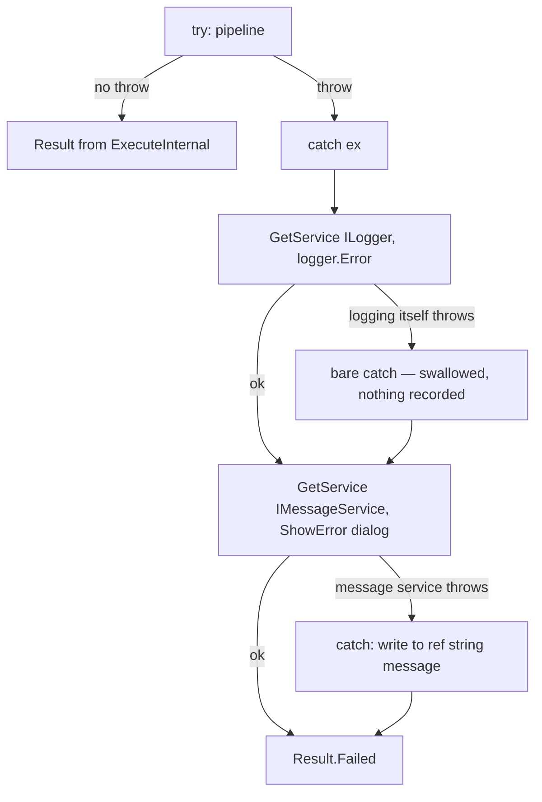

# Command flow — from ribbon button to interactor

This document exists because the knowledge graph cannot see this flow. Every command resolves its View
through `Host.GetService<T>()`, a generic DI call that AST extraction cannot turn into an edge, so
`graphify path` routes around it through shared namespace imports and returns a path that is not the real
call flow. Read this file instead of trying to trace a command in the graph.

## Flow

Two hops in this diagram exist nowhere in the graph: `Host.GetService<T>()` (generic DI) and the
`DataContext` binding between View and ViewModel. They are the ones to know by heart.



## The fixed pipeline

`BaseExternalCommand.Execute` ([source](../../source/Sonny.Application/Bases/BaseExternalCommand.cs)) is
sealed behaviour that every command inherits. It runs, in order:

1. `Host.Start()` — lazily builds the `IServiceProvider` (double-checked lock, idempotent). It also
   eagerly resolves `LanguageChangeHandler` so it can subscribe to language-change events, and registers
   an `AppDomain.CurrentDomain.UnhandledException` handler that logs `Fatal`.
2. License check — skipped when the command overrides `ShouldCheckLicense()` to return `false`.
   `LoginCommand` does this; feature commands do not. A failed check returns `Result.Cancelled`, **not**
   `Failed`, and shows nothing to the user.
3. `IUIDocumentProvider.SetUIDocument(commandData.Application.ActiveUIDocument)` — see
   [UIDocument lifetime](#uidocument-lifetime) below.
4. `RevitTask.Initialize(commandData.Application)` — arms Revit.Async so ViewModels can dispatch back
   into the API context.
5. `ExecuteInternal(...)` — the only part a concrete command implements.

### Silent behaviour in the error path

The whole pipeline sits in one `try`. The `catch` is where the surprises are:



Two things follow. First, **a command that throws surfaces a message box, not a Revit crash dialog** —
that is the point of the wrapper. Second, if the DI container itself is broken, the logging failure is
swallowed by a bare `catch { }` and you get a dialog with no trace anywhere. When a command fails with no
log line at all, suspect `Host` registration, not the command.

## What a concrete command may contain

Commands are thin by rule. The entire body of a feature command is: resolve a View, show it.

```csharp
protected override Result ExecuteInternal(ExternalCommandData commandData,
    ref string message,
    ElementSet elements)
{
    var view = Host.GetService<AutoColumnDimensionView>() ;
    view.Show() ;

    return Result.Succeeded ;
}
```

No business logic, no Revit API calls, no transactions. If you find yourself adding any of those to a
command, it belongs in an interactor instead.

One sanctioned variant: a command may run an **environment gate** before resolving the View — a check
that must reject the user *before* they fill in a dialog. `AutoJoinCommand` does this
(`IAutoJoinEnvironmentChecker`: family document, unsupported view type → message + `Result.Cancelled`).
The gate is still resolve-and-call — the decision logic lives in an Infrastructure service, not in the
command body.

## Adding a new tool

Five edits, in this order:

1. **Ribbon** — add a `[Button]` attribute to the right nested panel class in
   `source/Sonny.Application/Ribbon/SonnyTab.cs`.
2. **Command** — new class deriving `BaseExternalCommand` in `source/Sonny.Application/Commands/`,
   carrying `[Transaction(TransactionMode.Manual)]`. Body is resolve-and-show, nothing else.
3. **View + ViewModel** — under `source/Sonny.Application.Presentation/<Feature>/`. Register both in
   `Presentation/ServiceRegistration.cs`.
4. **Interactor** — interface and implementation in `Sonny.Application.UseCases`. That project references
   no Revit package and no Revit type, so the interactor is unit-testable without Revit. When the feature
   needs the Revit API, put the mechanism behind ports the interactor owns (DTO in, plan out — see
   [ADR 0001](../adr/0001-decision-logic-lives-in-usecases.md); `IColumnGeometryReader` /
   `IDimensionPlanExecutor` are the reference pair) and implement them in `Infrastructure`. Register each
   piece in the owning layer's `ServiceRegistration.cs`.
5. **Strings** — add keys to both `<Feature>.en.xaml` and `<Feature>.vi.xaml` under
   `source/Sonny.Application/Resources/Languages/<Feature>/`, then a `RegisterResource` call in
   `SonnyResourcesInitializer`. A missing key in one language is a runtime hole, not a compile error.

## UIDocument lifetime

The sharpest edge in this codebase.

`IUIDocumentProvider` is a **singleton** holding the `UIDocument` of the *currently running* command.
`BaseExternalCommand` overwrites it on every invocation. `IRevitDocument` is **transient** and every one of
its members is expression-bodied, reading through the provider on each call:

```csharp
public UIDocument UIDocument => uiDocumentProvider.GetUIDocument() ;
public Document   Document   => UIDocument.Document ;
public View       ActiveView => UIDocument.ActiveView ;
```

The rule that follows: **never cache `UIDocument`, `Document`, or `ActiveView` in a field.** Inject
`IRevitDocument` and read the property at the point of use.

This matters because several consumers are registered singleton — `ColumnDataExtractor`,
`ElementSelector`, `ColumnCreationStrategyFactory`, `ColumnGeometryReader`, `DimensionPlanExecutor` — and
keep their instance for the whole Revit session. A cached document there means every command after the
first operates on the wrong document, silently.

`GetUIDocument()` throws `InvalidOperationException` when the provider was never set, which is what you
get if you call into a service outside a command context. In tests, call `SetUIDocument` yourself in
`OnSetup` (both integration test fixtures do exactly this).

## Threading

ViewModels run on the WPF dispatcher thread, outside the Revit API context. Any call that touches the
Revit API from a ViewModel must go through `IRevitTaskRunner.RunAsync(...)`, which marshals it back via
Revit.Async. Calling the API directly from a ViewModel raises "attempting to modify the model outside of
a transaction or outside the API context" at runtime.

Note the asymmetry between the two existing features: `AutoColumnDimensionViewModel` wraps the interactor
call in `RunAsync` at the ViewModel, while `ColumnFromCadViewModel` calls `_columnFromCadInteractor.Execute`
directly and the interactor does its own `RunAsync` per phase internally. Both work; know which shape you
are copying.

## Transactions

Never construct `Transaction` directly. Use `ITransactionManagerFactory`:

- `Create(name)` — a single transaction, `using`-scoped.
- `Create(name, [FailurePreprocessorType.SuppressWarnings])` — same, with warning suppression.
- `CreateGroup(name)` — a transaction group; call `Assimilate()` at the end to collapse it into one
  undo entry.

The two features use opposite shapes on purpose — see each feature doc:

| Feature | Shape | Effect |
|---|---|---|
| `AutoColumnDimension` | one transaction around the whole loop | one undo step; nothing visible until commit |
| `ColumnFromCad` | transaction group, one inner transaction per column, `Assimilate()` at the end | one undo step, but each column appears in the UI as it is created |
