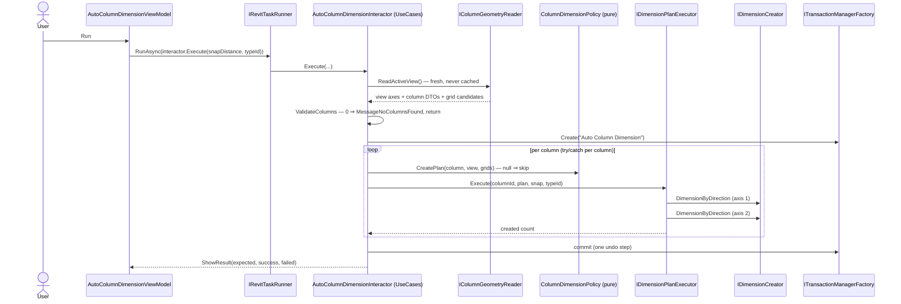
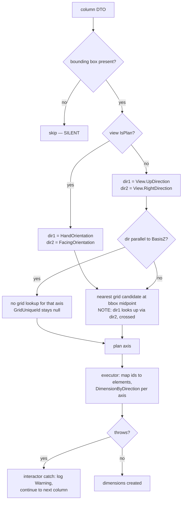

# AutoColumnDimension

Creates dimension lines between structural columns and the nearest grid, for every column visible in the
active view. One click, no per-column selection.

Ribbon → **Auto DIM** → dialog with a dimension type dropdown and a snap distance box → **Run**. The dialog
closes and a message box reports how many dimensions were created out of how many were expected.

## Contract

Change anything in this section and you are changing the requirement, not the implementation.

### Input

| Input | Source | Default | Notes |
|---|---|---|---|
| `snapDistance` | ViewModel, user-editable | `5.0` | In the user's display unit; converted before use |
| `dimensionTypeUniqueId` | ViewModel dropdown | `null` | `null` means Revit picks the view's default type |

The ViewModel resolves available types through `IDimensionTypeProvider.GetDimensionTypes()` and
recalculates snap distance from the chosen type via `UpdateSnapDistanceFromDimensionType()`.

**Scope is the active view, never the selection.** Selection is ignored entirely.

### Output

Up to two dimensions per column — one per axis — all inside one undo step. Plus a count report.

### Invariants

- **One transaction wraps the whole loop**, not each column. Moving `Create` inside the loop changes undo
  behaviour from one step to N.
- **The per-column `try/catch` is load-bearing.** Removing it turns one bad column into a failed run.
- No service on this path may cache `ActiveView` — the reader and executor read it fresh through
  `IRevitDocument` on every call. See
  [command-flow.md](../architecture/command-flow.md#uidocument-lifetime). This matters more than usual
  here: the interactor and both adapters are registered **singleton**.
- The crossing in the grid lookup is deliberate: the *first* dimension looks up its grid using the
  *second* direction, and vice versa. Do not "fix" the argument order. Since ADR 0001 the crossing lives
  in `ColumnDimensionPolicy` and is pinned by a unit test.

### Named failure modes

| Name | Trigger | Behaviour |
|---|---|---|
| `MessageNoColumnsFound` | zero valid columns in the view | `ValidateColumns` logs a warning, shows the message, returns — **no transaction opened** |
| *(unnamed)* **silent column drop** | `GetCenterPoint` returns null, or no bounding box in this view | column skipped, no user-facing warning |
| *(unnamed)* **caught per-column throw** | any exception during creation | logged at Warning, loop continues to the next column |
| *(reported as "failed")* | fewer than 2 dimensions produced for a column | counted as failure by arithmetic, **not** by an actual error |

The last row is a trap — see [Result reporting](#result-reporting).

## Flow

Note the shape: the **ViewModel** wraps the interactor call in `RunAsync`. `ColumnFromCad` does the
opposite (interactor marshals internally). Know which one you are copying.

Since ADR 0001 the interactor lives in **UseCases** and is Revit-free: geometry comes in through
`IColumnGeometryReader` as plain DTOs, decisions are made by the pure `ColumnDimensionPolicy`, and Revit
work goes out through `IDimensionPlanExecutor`.



## Behaviour

### Which columns are picked up

`ColumnGeometryReader.ReadActiveView`
([source](../../source/Sonny.Application.Infrastructure/Features/AutoColumnDimension/Implements/ColumnGeometryReader.cs))
takes every family instance in the **active view** and keeps those where the instance is in
`BuiltInCategory.OST_StructuralColumns` **and** `ColumnWrapperBase.GetCenterPoint(viewWrapper)` returns
non-null. The second condition silently drops columns whose geometry cannot be resolved in this view.
Each kept column becomes a Revit-free `ColumnGeometryData` (bounding box, hand/facing orientation); every
grid with a line becomes a `GridCandidate`.

### Per-column geometry and the axis branch

`ColumnDimensionPolicy.CreatePlan`
([source](../../source/Sonny.Application.UseCases/AutoColumnDimension/Implements/ColumnDimensionPolicy.cs))
computes the dimensioning plan, returning `null` — skipping the column — when the column has no bounding
box in this view. It is pure: unit tests pin the crossed lookup, the `BasisZ` skip and nearest-grid
selection without Revit.



A vertical axis has no meaningful grid to dimension against, which is why the `BasisZ`-parallel branch
skips the lookup rather than failing.

`DimensionPlanExecutor.Execute`
([source](../../source/Sonny.Application.Infrastructure/Features/AutoColumnDimension/Implements/DimensionPlanExecutor.cs))
maps the plan back to Revit: fetches the column by `UniqueId`, derives its planar faces, maps
`GridUniqueId` to a `GridWrapperBase`, and calls `IDimensionCreator.DimensionByDirection` twice — once per
axis. The interactor loop catches per column: **a failure on one column does not abort the run.** A run
over 40 columns where 3 throw still produces dimensions for the other 37 and reports success.

### Result reporting

`ShowResult` assumes **exactly 2 dimensions per column** (`ExpectedDimensionsPerColumn = 2`) and derives:

```
expected = columnCount * 2
success  = actual created count
failed   = max(0, expected - success)
```

So "failed" is **inferred arithmetic, not a real error count**. A column that legitimately produces only
one dimension — one axis parallel to Z, or one grid missing — is reported as one failure. Do not treat a
non-zero failure count as a defect without checking which branch fired.

## What a test should prove

Covered today, without Revit (`Sonny.Application.UnitTests`, `Debug R25`, seconds):

- `ColumnDimensionPolicyTests` — the crossed grid lookup, nearest-grid selection, anti-parallel grids,
  the `BasisZ` skip in non-plan views, the silent bbox-null skip, `MaxPoint` = bbox max.
- `AutoColumnDimensionInteractorTests` — `MessageNoColumnsFound` with **no transaction opened**, the
  arithmetic failure count, continue-on-throw with the commit still happening, silent skip of bbox-less
  columns.

```powershell
dotnet test source/Sonny.Application.UnitTests/Sonny.Application.UnitTests.csproj -c "Debug R25"
```

Covered with Revit by `AutoColumnDimensionIntegrationTest`
([source](../../source/Sonny.Application.Tests/Features/AutoColumnDimension/IntegrationTests/AutoColumnDimensionIntegrationTest.cs)),
pinned to a fixture document:

- File `Test_V2023.rvt`, view `Level 2`; asserts exactly **80** dimensions created
- Mocks `IMessageService` with NSubstitute so no dialog blocks the run
- Calls `IUIDocumentProvider.SetUIDocument` manually in `OnSetup`

```powershell
dotnet test source/Sonny.Application.Tests/Sonny.Application.Tests.csproj -c "Debug R23" `
  --filter "FullyQualifiedName~AutoColumnDimension_IntegrationTest_2F"
```

A real Revit 2023 install is required — the test adapter launches Revit. The column count is collected and
logged before the run (`Structural columns in view: N`) purely as diagnostics; nothing branches on it.

**Gaps.** These need a Revit document:

- A non-plan view (elevation/section) end to end — the *policy* branch is unit-tested, but no integration
  test drives the reader/executor through a non-plan view.
- A column that throws during creation inside Revit — the interactor's catch is unit-tested with a mocked
  executor only.
- `snapDistance` boundary values (0, negative) → currently unvalidated in the interactor.

## Related

- [command-flow.md](../architecture/command-flow.md) — the pipeline above the ViewModel, and the
  transaction-shape comparison against `ColumnFromCad`
- [ColumnFromCad.md](ColumnFromCad.md) — the opposite marshalling shape
- [ADR 0001](../adr/0001-decision-logic-lives-in-usecases.md) — why the interactor moved to UseCases and
  the decision/mechanism split
- Symbols for `codegraph explore`: `AutoColumnDimensionInteractor ColumnDimensionPolicy
  ColumnGeometryReader DimensionPlanExecutor IDimensionCreator DimensionCreator ColumnWrapperBase`
