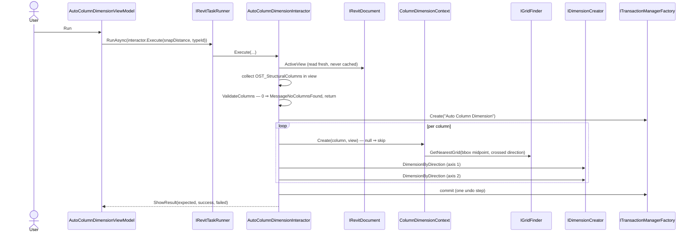
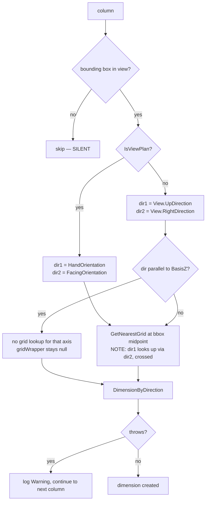

# AutoColumnDimension

Creates dimension lines between structural columns and the nearest grid, for every column visible in the
active view. One click, no per-column selection.

Ribbon → **Auto DIM** → dialog with a dimension type dropdown and a snap distance box → **Run**. The dialog
closes and a message box reports how many dimensions were created out of how many were expected.

## Contract

Change anything in this section and you are changing the requirement, not the implementation.

### Input

| Input | Source | Default | Notes |
|---|---|---|---|
| `snapDistance` | ViewModel, user-editable | `5.0` | In the user's display unit; converted before use |
| `dimensionTypeUniqueId` | ViewModel dropdown | `null` | `null` means Revit picks the view's default type |

The ViewModel resolves available types through `IDimensionTypeProvider.GetDimensionTypes()` and
recalculates snap distance from the chosen type via `UpdateSnapDistanceFromDimensionType()`.

**Scope is the active view, never the selection.** Selection is ignored entirely.

### Output

Up to two dimensions per column — one per axis — all inside one undo step. Plus a count report.

### Invariants

- **One transaction wraps the whole loop**, not each column. Moving `Create` inside the loop changes undo
  behaviour from one step to N.
- **The per-column `try/catch` is load-bearing.** Removing it turns one bad column into a failed run.
- The interactor must never cache `revitDocument.ActiveView` — it reads it fresh each call. See
  [command-flow.md](../architecture/command-flow.md#uidocument-lifetime). This matters more than usual
  here: `AutoColumnDimensionInteractor` is registered **singleton**.
- The crossing in the grid lookup is deliberate: the *first* dimension looks up its grid using the
  *second* direction, and vice versa. Do not "fix" the argument order.

### Named failure modes

| Name | Trigger | Behaviour |
|---|---|---|
| `MessageNoColumnsFound` | zero valid columns in the view | `ValidateColumns` logs a warning, shows the message, returns — **no transaction opened** |
| *(unnamed)* **silent column drop** | `GetCenterPoint` returns null, or no bounding box in this view | column skipped, no user-facing warning |
| *(unnamed)* **caught per-column throw** | any exception during creation | logged at Warning, loop continues to the next column |
| *(reported as "failed")* | fewer than 2 dimensions produced for a column | counted as failure by arithmetic, **not** by an actual error |

The last row is a trap — see [Result reporting](#result-reporting).

## Flow

Note the shape: the **ViewModel** wraps the interactor call in `RunAsync`. `ColumnFromCad` does the
opposite (interactor marshals internally). Know which one you are copying.



## Behaviour

### Which columns are picked up

`AutoColumnDimensionInteractor.Execute`
([source](../../source/Sonny.Application.Infrastructure/Features/AutoColumnDimension/Implements/AutoColumnDimensionInteractor.cs))
takes every family instance in the **active view** and keeps those where the instance is in
`BuiltInCategory.OST_StructuralColumns` **and** `ColumnWrapperBase.GetCenterPoint(viewWrapper)` returns
non-null. The second condition silently drops columns whose geometry cannot be resolved in this view.

### Per-column geometry and the axis branch

`ColumnDimensionContext.Create`
([source](../../source/Sonny.Application.Infrastructure/Features/AutoColumnDimension/Contexts/ColumnDimensionContext.cs))
computes the dimensioning frame, returning `null` — skipping the column — when the column has no bounding
box in this view.



A vertical axis has no meaningful grid to dimension against, which is why the `BasisZ`-parallel branch
skips the lookup rather than failing.

`AutoColumnDimension.Execute`
([source](../../source/Sonny.Application.Infrastructure/Features/AutoColumnDimension/Implements/AutoColumnDimension.cs))
loops the columns and calls `IDimensionCreator.DimensionByDirection` twice per column — once per axis.
**A failure on one column does not abort the run.** A run over 40 columns where 3 throw still produces
dimensions for the other 37 and reports success.

### Result reporting

`ShowResult` assumes **exactly 2 dimensions per column** (`ExpectedDimensionsPerColumn = 2`) and derives:

```
expected = columnCount * 2
success  = actual created count
failed   = max(0, expected - success)
```

So "failed" is **inferred arithmetic, not a real error count**. A column that legitimately produces only
one dimension — one axis parallel to Z, or one grid missing — is reported as one failure. Do not treat a
non-zero failure count as a defect without checking which branch fired.

## What a test should prove

Covered today by `AutoColumnDimensionIntegrationTest`
([source](../../source/Sonny.Application.Tests/Features/AutoColumnDimension/IntegrationTests/AutoColumnDimensionIntegrationTest.cs)),
pinned to a fixture document:

- File `Test_V2023.rvt`, view `Level 2`; asserts exactly **80** dimensions created
- Mocks `IMessageService` with NSubstitute so no dialog blocks the run
- Calls `IUIDocumentProvider.SetUIDocument` manually in `OnSetup`

```powershell
dotnet test source/Sonny.Application.Tests/Sonny.Application.Tests.csproj -c "Debug R23" `
  --filter "FullyQualifiedName~AutoColumnDimension_IntegrationTest_2F"
```

A real Revit 2023 install is required — the test adapter launches Revit. The column count is collected and
logged before the run (`Structural columns in view: N`) purely as diagnostics; nothing branches on it. An
earlier `Assert.Inconclusive` guard on that count was removed because it fired exactly when the fixture
held its expected columns — the test skipped itself instead of asserting.

**Gaps.** All of these need a Revit document; see the note below.

- A view with zero structural columns → asserts `MessageNoColumnsFound` shown, no transaction opened.
- A non-plan view (elevation/section) → exercises the `View.UpDirection` / `BasisZ`-parallel branch, which
  no current test touches.
- A column that throws during creation → asserts the run completes and the remaining columns still get
  dimensions.
- A column producing one dimension → asserts the reported "failed" count is 1, pinning the inferred
  arithmetic so a future reader does not mistake it for a bug.
- `snapDistance` boundary values (0, negative) → currently unvalidated in the interactor.

**Nothing in this feature is unit-testable without Revit**, and that is a structural fact, not an
oversight: the interactor lives in `Infrastructure` and `ColumnDimensionContext.Create` takes Revit
wrappers throughout. Contrast `ColumnFromCad`, whose interactor is in `UseCases` with no Revit type and is
fully mockable. If this feature is ever refactored, splitting the geometry decision (plan vs non-plan,
`BasisZ` check, crossed grid lookup) into a Revit-free helper is what would make it testable.

## Related

- [command-flow.md](../architecture/command-flow.md) — the pipeline above the ViewModel, and the
  transaction-shape comparison against `ColumnFromCad`
- [ColumnFromCad.md](ColumnFromCad.md) — the opposite marshalling shape and the pure-interactor form
- Symbols for `codegraph explore`: `AutoColumnDimensionInteractor AutoColumnDimension
  ColumnDimensionContext IGridFinder IDimensionCreator ColumnWrapperBase`
