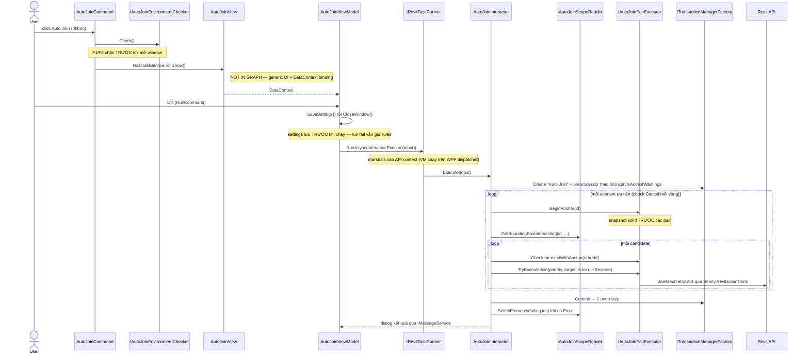
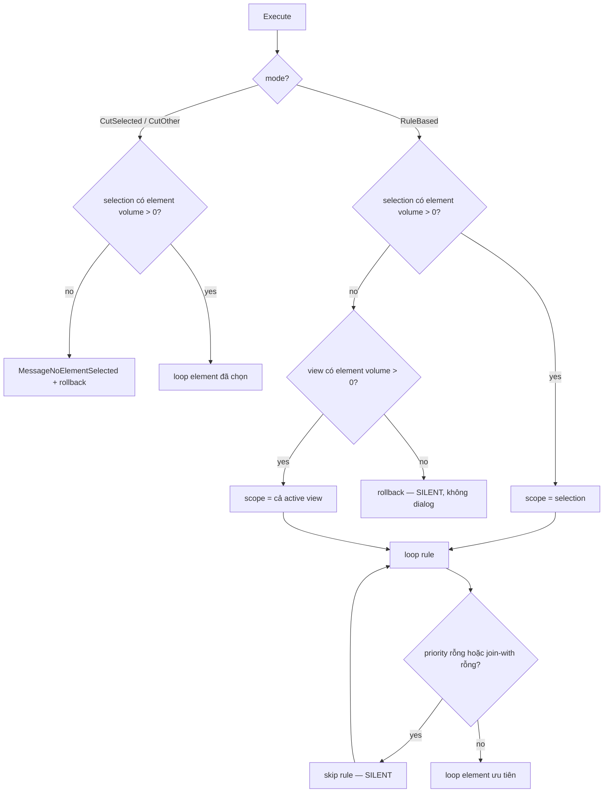
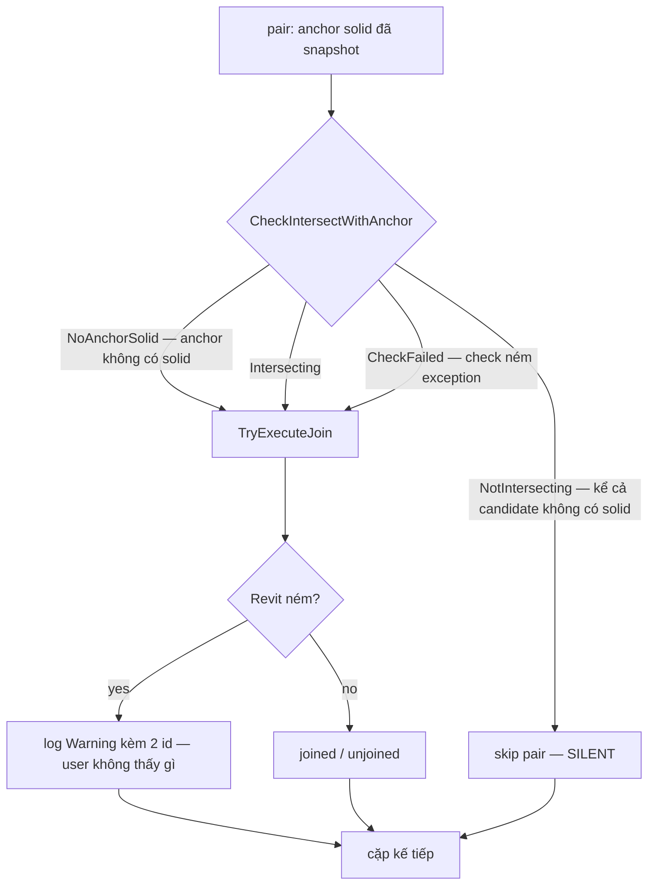
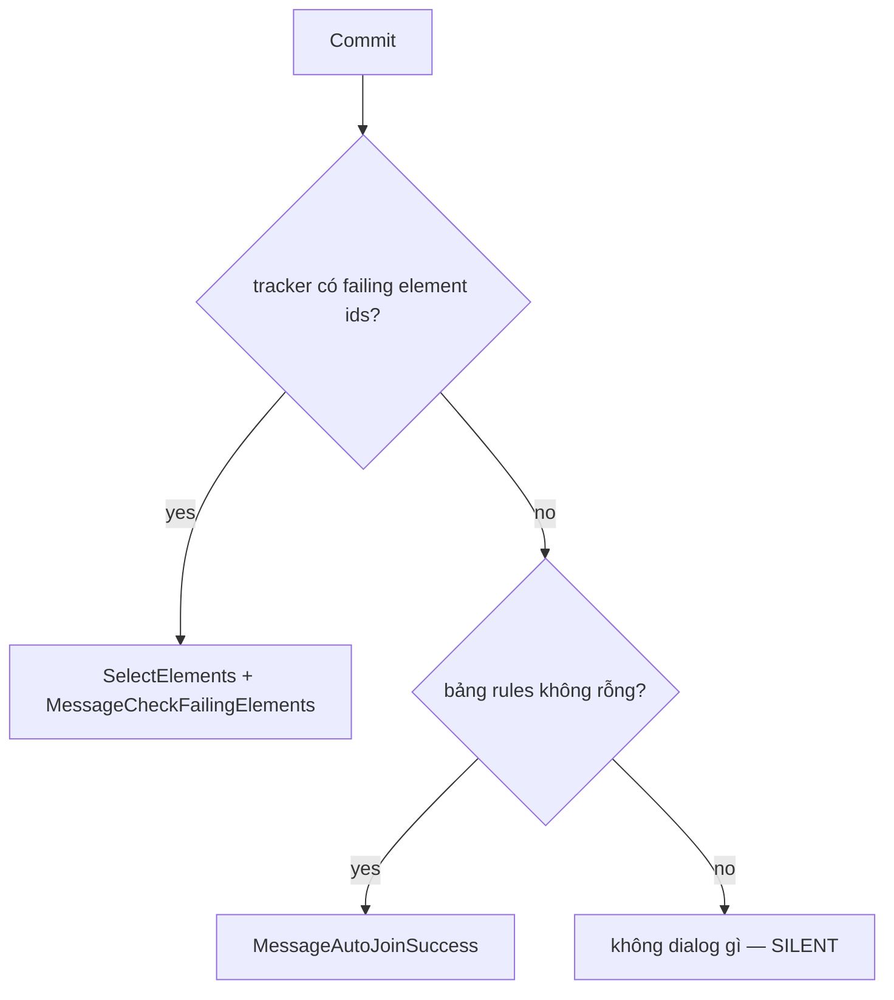

# AutoJoin

Tự động join/unjoin các cấu kiện Revit theo bộ quy tắc ưu tiên (Priority category cắt Join-With
category), port giữ-nguyên-hành-vi từ AlphaBIM (`AlphaStructure/03.StructuralSolutions/18.JoinElements`,
command `AutoJoinCmd`). Người dùng bấm nút **Auto Join** trên ribbon (panel Join Tools), khai báo rule
trong một DataGrid — hoặc chọn một trong hai chế độ theo selection — bấm OK; mọi cặp element giao nhau
thật (kiểm bằng solid) được join theo đúng thứ tự cắt, undo được trong một bước.

Nhiều chỗ trong file này **trông như bug nhưng là hành vi cố ý port từ bản gốc** — chúng được đánh dấu
rõ. Đọc mục Behaviour trước khi "sửa" bất kỳ chỗ nào trong số đó.

## Contract

Change anything in this section and you are changing the requirement, not the implementation.

### Input

| Input | Source | Default | Notes |
|---|---|---|---|
| Mode | 2 checkbox `IsCutSelectedElements` / `IsCutOtherElements`, loại trừ lẫn nhau; cả hai tắt = rule-based | rule-based | Bật một trong hai thì disable bảng rules và checkbox UnJoin (`IsEnabledScope`) |
| Rules | DataGrid; mỗi rule = PriorityCategory (11 giá trị) × JoinWithCategory (11 + `<All>`) × IsReverse | Selection có element model-category map được → seed 1 rule theo bảng mapping trong `AutoJoinSeedMapper`; selection có nhưng không map được → bảng **rỗng**; không có selection → settings lần cuối; settings rỗng → (Structural Framing, `<All>`) | Tên category hiển thị tiếng Anh y hệt bản gốc, không localize |
| IsUnjoin | checkbox | false | Chỉ có nghĩa ở rule-based |
| IsAcceptWarning | checkbox | false | true (hoặc IsUnjoin) → preprocessor `DeleteWarningsResolveErrors`; false → `ResolveAllFailures` |
| Selection + ActiveView | trạng thái Revit lúc bấm nút | — | Element hợp lệ = có param `HOST_VOLUME_COMPUTED` > 0 |
| Nới bounding box | hằng số trong `AutoJoinScopeReader` | **5 mm** theo X/Y, không nới Z | Đổi sang feet bằng 1 ft = 304.8 mm trong `Sonny.RevitExtensions` |

### Output

- Các cặp giao nhau được join; thứ tự cắt: priority cắt join-with (`SwitchJoinOrder` khi cần),
  `IsReverse` đảo thêm một lần. `IsUnjoin = true` thì unjoin các cặp đang joined.
- **Undo = 1 bước** — một Transaction `"Auto Join"` cho cả run.
- Rules được auto-save vào settings (`%APPDATA%\Sonny\AutoJoinSettings.json`) **trước** khi chạy — run
  fail vẫn giữ rules.
- Sau commit: có element gây Error → chúng được **select** trong Revit + dialog nhắc check; không có →
  dialog thành công, nhưng **chỉ khi bảng rules không rỗng**.
- Mỗi cặp join thất bại được log Warning qua Serilog kèm 2 element id — người dùng không thấy gì.

### Invariants

- `AutoJoinInteractor` (UseCases) không đụng Revit type — phá thì mất ranh giới ADR 0001 và mất 16 unit
  test đang khoá toàn bộ nhánh quyết định.
- Không cache `UIDocument`/`Document`/`ActiveView` trong field service singleton — phá thì mọi lệnh sau
  lệnh đầu chạy âm thầm trên document sai (UIDocument lifetime rule).
- Một Transaction duy nhất, tạo qua `ITransactionManagerFactory` — phá thì Cancel không rollback sạch và
  undo vỡ thành nhiều bước.
- `BeginAnchor` phải được gọi **trước** các pair của một element — solid snapshot lấy trước khi join, vì
  join làm biến dạng solid của element bị cắt; check bằng solid mới sẽ bỏ sót candidate về sau.
- Candidate bounding-box luôn exclude chính element probe — phá thì element tự join với nó, Revit ném.
- Check môi trường (family doc, view type) chạy trong `AutoJoinCommand` **trước** khi resolve View — phá
  thì user khai xong rules mới bị từ chối.

### Named failure modes

| # | Tên | Trigger | Hành vi |
|---|---|---|---|
| F1 | FamilyDocumentBlocked | `Document.IsFamilyDocument` | `MessageAutoJoinFamilyDocument`, `Result.Cancelled`, không mở window |
| F2 | UnsupportedViewBlocked | ActiveView là Schedule / ColumnSchedule / DrawingSheet | `MessageAutoJoinUnsupportedView`, `Result.Cancelled`, không mở window |
| F3 | NoSelectionForCutMode | Mode cut mà selection không có element volume > 0 | `MessageNoElementSelected` rồi rollback |
| F4 | *(unnamed)* **silent rollback** | Rule-based: không selection và view không có element volume > 0 | Rollback lặng lẽ, **không dialog, không log** — y hệt gốc |
| F5 | *(unnamed)* **silent skip rule** | Rule có phía priority hoặc join-with rỗng | `continue` sang rule kế, không báo |
| F6 | JoinWithoutSolidCheck | Element anchor không lấy được solid (`GetSolidMax` null) | Join mọi bbox-candidate **không cần** check — hành vi gốc, không phải lỗi |
| F7 | *(unnamed)* **silent skip pair** | Candidate không có solid, hoặc hai solid không giao nhau | Bỏ cặp, không báo, không log |
| F8 | JoinAnywayOnCheckError | Check solid ném exception | **Join luôn** — join thừa còn hơn bỏ sót, cố ý |
| F9 | *(unnamed)* **silent skip + log** | `JoinGeometryUtils` ném khi join/unjoin/switch | Nuốt, log Warning kèm 2 id, chạy tiếp |
| F10 | FailingElementsReported | Commit có failure severity Error (đường `ResolveAllFailures`) | Resolve + gom id vào `IFailingElementIdsTracker`; sau commit select chúng + `MessageCheckFailingElements` |
| F11 | CancelRollsBackAll | User bấm Cancel trên progress | Rollback toàn bộ + `MessageAutoJoinCancelled` |
| F12 | LicenseCheckFailed | License không hợp lệ | `Result.Cancelled` im lặng — pipeline `BaseExternalCommand` |
| F13 | *(unnamed)* **silent empty rules** | Settings/file rule hỏng khi load | Auto-load: bảng về mặc định; Load file: giữ bảng cũ; chỉ log Warning |

## Flow

Hình dạng đặc thù: command có **gate môi trường trước khi mở View** (khác hai feature kia), và interactor
chạy đồng bộ trong một lần `RunAsync` với một transaction duy nhất (giống `AutoColumnDimension`, khác
`ColumnFromCad` dùng transaction group).



## Behaviour

Chỉ những gì đọc code nhanh sẽ không thấy.

### Chọn mode và scope — nhánh quyết định



### Một cặp element — mọi đường tới join và tới skip



Hệ quả thực tế: một run có thể join 200 cặp, fail 15 cặp, và người dùng chỉ thấy "Auto Join
successfully!" — 15 cặp fail nằm trong Serilog, không nằm trên UI. Đó là hành vi gốc (D3 chỉ thêm log).

### Sau commit



Hai điều kiện ở đây đều là quirk gốc được giữ: (1) dialog thành công bị gate bởi *bảng rules* kể cả ở
hai chế độ cut không dùng rules; (2) đường `DeleteWarningsResolveErrors` (Unjoin/AcceptWarnings) **không
ghi failing ids** — bản gốc thu thập rồi không bao giờ đọc, nên bản port bỏ luôn phía ghi.

### Trông như bug nhưng là cố ý — đừng "sửa"

- **"Architectural Floor/Wall" khớp MỌI floor/wall**, không phân biệt structural. Bản gốc có nhánh phân
  biệt nhưng là dead code (`if (list is Floor)` luôn false); quyết định D1 chốt giữ hành vi thực tế và
  không port nhánh chết. Chỉ `Structural Floor/Wall` lọc theo param structural.
- **Mapping auto-seed lạ** (`AutoJoinSeedMapper`): chọn sẵn Structural Columns → seed "Architectural
  Column", Walls → "Structural Wall", Floors → "Architectural Floor". Y hệt gốc (D4), có test khoá từng
  case — test đỏ ở đây nghĩa là ai đó "sửa" quirk, không phải quirk sai.
- **Nút Add khi bảng rỗng** tạo rule (Structural Framing, **Architectural Column**) chứ không phải
  `<All>` — quirk fallback của gốc, giữ nguyên.
- **Phía join-with chấp nhận volume ≥ 0** (khác phía scope đòi > 0) — nguyên văn điều kiện gốc.
- **BeginAnchor tách khỏi CheckIntersect**: anchor solid là snapshot trước-join; gộp hai call lại cho
  "sạch" sẽ đổi kết quả ở chế độ Cut Selected (element bị cắt teo dần sau mỗi join).
- **Revit có thể lặng lẽ gỡ một join lúc commit** khi hai kẻ cắt chồng vùng cắt trên cùng một element
  (vd beam và generic model cùng cắt một cột ở vùng giao nhau): join thành công trong transaction,
  nhưng lúc commit Revit phán cặp sau "joined but do not intersect" và tự unjoin qua failure
  resolution. Không đi qua F9 (TryExecuteJoin đã trả true) nên không có log; failing ids cũng rỗng vì
  là warning. Đây là hành vi Revit, bản gốc AlphaBIM chịu y hệt — phát hiện khi dựng integration test.

### Khác bản gốc một chỗ — deviation có chủ ý

Selection có element nhưng **category không map được** (vd Door): bản gốc tạo rule với tên priority rỗng,
và vì id mặc định = 0 trùng `ArchitecturalFloorCategoryId`, rule đó âm thầm hành xử như "Architectural
Floor cắt All" — gần chắc là tai nạn. Bản Sonny để bảng **rỗng** trong trường hợp này.
`AutoJoinSeedMapperTests.CreateSeedRule_UnmappedCategory_ReturnsNull` khoá deviation này. Muốn y hệt tai
nạn gốc thì đổi Contract trước.

### Cancel

`IProgressReporter.IsCancelRequested` là flag do nút Cancel trên `ProgressView` set; interactor **poll
mỗi element ưu tiên** (không phải mỗi cặp). Cancel giữa một element nhiều candidate sẽ hoàn tất element
đó rồi mới rollback. Nút Cancel chỉ hiện khi `Show(title, allowCancel: true)` — `ColumnFromCad` gọi
`Show(title)` nên UI của nó không đổi.

## What a test should prove

Đang khoá (Revit-free, chạy vài giây):

```powershell
dotnet test source/Sonny.Application.UnitTests/Sonny.Application.UnitTests.csproj -c "Debug R25"
```

- `AutoJoinInteractorTests` — 16 test, mỗi failure mode F3–F11 một test, cộng: orientation cặp ở hai
  chế độ cut (chiều priority/target đảo nhau), fallback scope selection→view, chọn preprocessor theo
  IsUnjoin/IsAcceptWarnings, thứ tự `BeginAnchor` → check → join, gate dialog thành công theo bảng rules.
- `AutoJoinSeedMapperTests` — từng mapping kể cả 3 quirk, và unmapped → null (deviation).
- `AutoJoinRuleTests` — default (Beam, All, không reverse).

Giòn ở đâu: tất cả dùng quy ước resource-key passthrough (`GetString` trả về key) và bind vào 2 port —
đổi signature port là compile-fail hàng loạt (retarget wiring được, assertion không được đổi — xem
[test-safety-net.md](../../.sonnyflow/test-safety-net.md)).

Đang khoá (Revit thật, mở fixture `Test_V2023_AutoJoin.rvt`):

```powershell
dotnet test source/Sonny.Application.Tests/Sonny.Application.Tests.csproj -c "Debug R23" --filter "FullyQualifiedName~AutoJoinIntegrationTest"
```

- `AutoJoinIntegrationTest` — 16 test chạy interactor thật với adapter Infrastructure thật, assert qua
  `JoinGeometryUtils`: từng category rule (Beam/StructuralColumn/ArchitecturalColumn/Floors/Walls/
  Foundation/Roof/Ceiling/GenericModel/All), chiều cut và IsReverse, phân biệt structural vs
  architectural floor/wall (kể cả quirk ArchWall khớp structural wall), F7 (bbox giao nhưng solid
  không — arc wall), unjoin cặp pre-joined, và 2 chế độ CutSelected/CutOther.
- Fixture do `AutoJoinFixtureBuilder` vẽ bằng chính Revit 2023 (một station 15 m/case, element tìm
  bằng tag trong param Comments — xem `AutoJoinFixtureTags`). Muốn vẽ lại: xóa
  `Resources/RevitFiles/Test_V2023_AutoJoin.rvt` rồi chạy
  `dotnet test ... -c "Debug R23" --filter "FullyQualifiedName~AutoJoinFixtureBuilder"` — builder
  tự kiểm solid giao nhau từng case trước khi save, và tự Ignore khi file đã tồn tại hoặc không phải
  Revit 2023. Builder mang theo mấy bài học trả giá bằng nhiều lần chạy: mọi callback managed nằm trong
  test assembly (IFailuresPreprocessor, IFamilyLoadOptions) làm commit/load fail lặng lẽ trong host
  ricaun; document phải được mở ở OnSetup (event riêng) chứ không phải trong test; view của fixture
  phải bật tường minh các category kiến trúc vì placeholder gốc structural ẩn chúng.

**Gaps.**

- `AutoJoinViewModel` (mutual exclusion 2 chế độ cut, seed thắng settings, save-trước-run) — Presentation
  không nằm trong `Sonny.Application.UnitTests` (kéo `Autodesk.Windows`), nên không autotest được hôm nay.
- Undo đúng 1 bước và select-failing-elements (F10) chưa có assertion máy — F10 cần dựng được failure
  error-severity tái lập trong fixture.

## Related

- **Bug đang mở: [AJ-001](../bugs/AJ-001-overlapping-cut-regions-silently-unjoined.md)** — hai kẻ cắt
  chồng vùng cắt: Revit lặng lẽ gỡ join sau tại commit, tool vẫn báo thành công

- [command-flow.md](../architecture/command-flow.md) — pipeline `BaseExternalCommand`, UIDocument
  lifetime; AutoJoin thêm một biến thể: command có gate môi trường trước resolve-and-show
- [AutoColumnDimension.md](AutoColumnDimension.md) — feature mẫu cho ports ADR 0001 mà AutoJoin noi theo
- [ADR 0001](../adr/0001-decision-logic-lives-in-usecases.md) — vì sao interactor nằm UseCases sau ports
- [retro sonny-flow của feature này](../../.sonnyflow/retro/AutoJoin-retro.md) — ghi chú cải thiện skill
- Nguồn gốc AlphaBIM: `AlphaStructure/03.StructuralSolutions/18.JoinElements` (repo AlphaBIMSolution)
- Symbols for `codegraph explore`: `AutoJoinInteractor IAutoJoinScopeReader IAutoJoinPairExecutor
  AutoJoinScopeReader AutoJoinPairExecutor AutoJoinSeedMapper AutoJoinViewModel AutoJoinCommand
  ResolveAllFailuresPreprocessor DeleteWarningsResolveErrorsPreprocessor FailingElementIdsTracker
  ElementJoinExtensions GetSolidMax GetBoundingBoxIntersectingElements`
