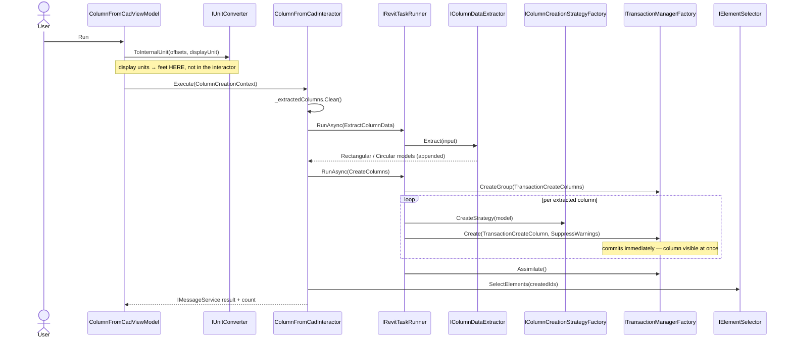
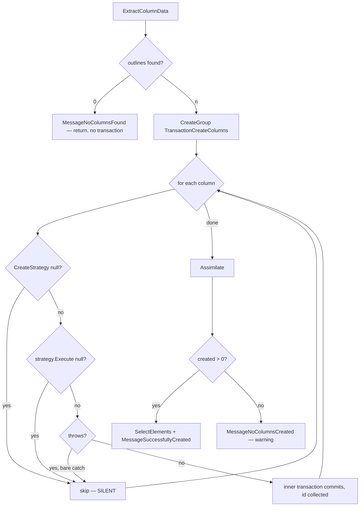

# ColumnFromCad

Reads column outlines from a linked AutoCAD drawing and creates real Revit structural columns from them.

Ribbon → **AutoCAD to Revit** → dialog: pick the CAD link, pick the layer holding column outlines, pick the
families and parameters to drive width/height/diameter, pick base and top levels with offsets → **Run**.
A progress window tracks creation; on completion the created columns are selected in the Revit UI and a
message box reports the count.

## Contract

Change anything in this section and you are changing the requirement, not the implementation.

### Input

`ColumnCreationContext` wraps `ColumnFromCadSettings` plus two pre-converted offsets:

| Field | Meaning |
|---|---|
| `SelectedCadLinkId` | `UniqueId` of the `ImportInstance` |
| `SelectedLayer` | CAD layer name holding the outlines, e.g. `"S-COLS"` |
| `IsModelByHatch` | hatch regions vs boundary lines |
| `RectangularColumnFamilyId` / `CircularColumnFamilyId` | `UniqueId` of the families to instantiate |
| `WidthParameter` / `HeightParameter` / `DiameterParameter` | family parameter names, e.g. `"b"`, `"h"` |
| `BaseLevelId` / `TopLevelId` | `UniqueId` of the levels |
| `BaseOffsetDisplay` / `TopOffsetDisplay` | offsets **in display units** |
| `BaseOffset` / `TopOffset` (on the context) | the same offsets **already converted to feet** |

### Output

Structural column instances in the model, one per extracted outline that a strategy could handle, all
inside one undo step. Created elements end up selected in the UI.

### Invariants

- **Unit boundary: the interactor receives feet and never converts.** Conversion happens outside, via
  `IUnitConverter.ToInternalUnit(value, displayUnit)` where `displayUnit` comes from
  `ISettingsService.GetDisplayUnitOrDefault(() => displayUnitProvider.GetDefaultDisplayUnit())`. Passing
  display units into `BaseOffset` puts columns at the wrong elevation **with no error**.
- `_extractedColumns` is interactor state and must survive between the two calls within one run — do not
  make it a local, and do not assume it is safe across concurrent runs.
- Inner transactions must commit **inside** the loop. Deferring them to the end breaks the "columns appear
  progressively" behaviour and changes failure isolation.
- `Assimilate()` must stay. Without it the user gets 45 undo steps instead of one.
- Never cache `UIDocument` / `Document` / `ActiveView` — see
  [command-flow.md](../architecture/command-flow.md#uidocument-lifetime).

### Named failure modes

| Name | Trigger | Behaviour |
|---|---|---|
| `MessageNoColumnsFound` | extraction returns zero outlines | info; return before any transaction |
| `MessageNoExtractedColumnsFound` | `CreateColumns` called before `ExtractColumnData` | throws `InvalidOperationException` |
| `MessageNoColumnsCreated` | extraction found outlines, creation produced none | **warning**, not info |
| `MessageSuccessfullyCreated` | at least one column created | info, with the count |
| *(unnamed)* **silent per-column skip** | strategy null, strategy result null, or any exception | column dropped, **no message, no log** |

The last row is the important one and it has no name because nothing reports it. See below.

## Flow

Note the shape: the ViewModel calls the interactor directly, and the **interactor** does its own
`RunAsync` per phase. `AutoColumnDimension` does the opposite. Know which one you are copying.



## Behaviour

`ColumnFromCadInteractor.Execute`
([source](../../source/Sonny.Application.UseCases/ColumnFromCad/Implements/ColumnFromCadInteractor.cs))
runs three phases. The interactor lives in `UseCases` and touches **no Revit type** — it is the pure form,
and it is mockable end to end with NSubstitute.

### Order dependency and the silent skips

`ExtractColumnData` **accumulates into a field**, `_extractedColumns`; `Execute` clears that list first and
`ExtractColumnData` only appends. `CreateColumns` throws if called before extraction.

**The two methods are order-dependent through shared state** — this is the single most surprising thing
about the feature, and it is why the integration test calls `ExtractColumnData` and `CreateColumns`
separately rather than calling `Execute`.



**Per-column failure is silent and non-fatal.** A run of 45 columns that creates 30 reports "30 created"
with no indication that 15 were dropped or why. If you are debugging missing columns, the log is not
enough — step the strategy factory.

Two model shapes come back, distinguished by the CAD geometry: `RectangularColumnModel` (carries a
`RotationAngle`) and `CircularColumnModel` (carries a diameter). The `IsModelByHatch` setting switches
extraction between hatch regions and boundary lines.

Each inner transaction carries `FailurePreprocessorType.SuppressWarnings` — Revit warnings during column
placement are swallowed by design. The progress window (`IProgressReporter`) opens before the loop and
closes in a `finally`, so it survives an exception escaping the group.

## What a test should prove

Covered today by `ColumnFromCadIntegrationTest`
([source](../../source/Sonny.Application.Tests/Features/ColumnFromCad/IntegrationTests/ColumnFromCadIntegrationTest.cs)),
pinned to `Test_V2023_ModelColumnFromAutoCad.rvt` and to hard-coded `UniqueId`s for the CAD link, families
and levels:

| Assertion | Expected |
|---|---|
| rectangular columns extracted | 37 |
| circular columns extracted | 8 |
| total columns created | 45 |
| distinct rotation angles present | 0, 0.9599…, 1.5708, 2.2515 (×2), 3.1416 |
| created ID count == model column delta | yes |

```powershell
dotnet test source/Sonny.Application.Tests/Sonny.Application.Tests.csproj -c "Debug R23" `
  --filter "FullyQualifiedName~ColumnFromCad_CreateColumns_Test"
```

Because the assertions are exact counts against one document, **any change to the fixture invalidates
them**. Treat the `.rvt` as part of the test contract. Note the expected-angle list contains
`2.2514747350726836` and `2.2514747350726911` — two values differing at the 14th decimal, compared through
a `HashSet<double>` with exact equality, so this test is sensitive to floating-point drift in the
extraction path.

**Gaps.** These need no Revit document — the interactor is Revit-free, so they belong in
`Sonny.Application.UnitTests` with the eight collaborators mocked:

- `CreateColumns` without `ExtractColumnData` → asserts `InvalidOperationException`. The order dependency
  is the feature's main trap and nothing guards it today.
- Extraction returns zero → asserts `MessageNoColumnsFound` and that no transaction group was opened.
- Strategy returns null for 2 of 5 columns → asserts the run completes, reports 3, and that the 2 drops
  produce no message. This is the silent-skip behaviour, pinned.
- Every column throws → asserts `MessageNoColumnsCreated` as a warning, and that `Assimilate` still ran.
- `_extractedColumns` does not leak between two consecutive `Execute` calls.

Not unit-testable without Revit: the offset conversion. `IUnitConverter` is implemented by
`UnitConverter` in `Infrastructure`, which calls `UnitUtils.Convert` with `ForgeTypeId`/`UnitTypeId` —
Revit API types. That test stays in `Sonny.Application.Tests`.

## Related

- [command-flow.md](../architecture/command-flow.md) — the pipeline above the ViewModel, and the
  transaction-shape comparison against `AutoColumnDimension`
- Symbols for `codegraph explore`: `ColumnFromCadInteractor ColumnDataExtractor
  ColumnCreationStrategyFactory ColumnCreationContext ColumnFromCadSettings`
