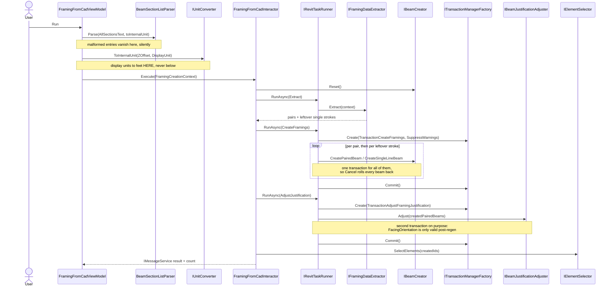
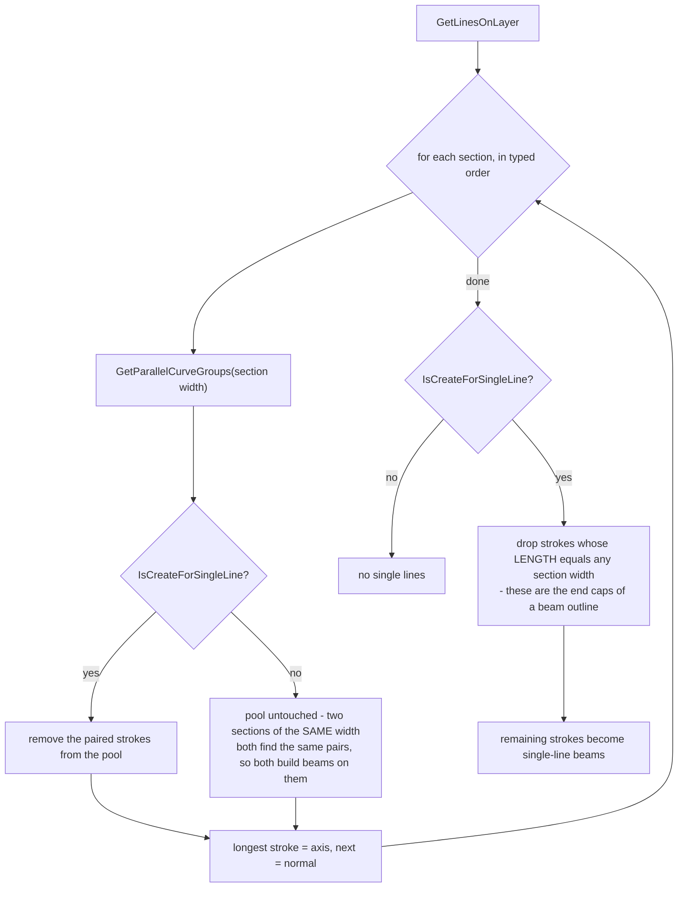
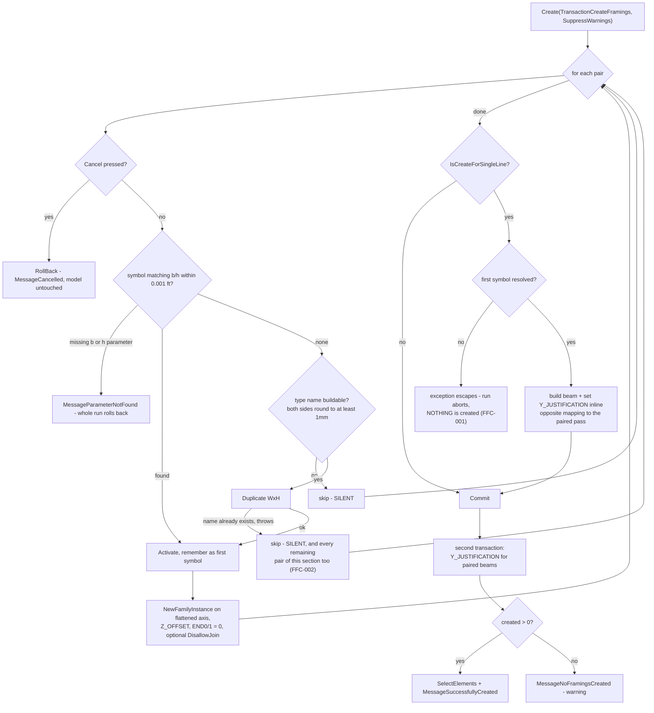

# FramingFromCad

Reads pairs of parallel strokes from a linked AutoCAD drawing and creates real Revit structural framing from
them: two lines one beam width apart are one beam.

Ribbon → **Model from CAD** → **Framing from CAD** → pick the CAD link in the view → dialog: layer, beam
family, the two type parameters carrying width and height, reference level, z offset, the free-text section
list, and two checkboxes → **Run**. A cancellable progress window tracks creation; on completion the created
beams are selected in the Revit UI and a message reports the count.

## Contract

Change anything in this section and you are changing the requirement, not the implementation.

### Input

`FramingCreationContext` wraps `FramingFromCadSettings` plus everything already converted to feet:

| Field | Source | Default | Unit |
|---|---|---|---|
| `SelectedCadLinkId` | picked in the view before the dialog opens (`ICadLinkSelector`) | — required | `UniqueId` of the `ImportInstance` |
| `SelectedLayer` | ComboBox | first layer whose name contains `"beam"`, **case-insensitively**; else the first layer | layer name |
| `SelectedFamilyId` | ComboBox — exactly **one** framing family | first family by name among those with at least one type | `UniqueId` |
| `WidthParameter` / `HeightParameter` | ComboBox over the family's numeric type parameters (Assembly/OmniClass/Material/Category/Type filtered out) | `"b"` / `"h"` when present, else the first parameter | parameter name |
| `ReferenceLevelId` | ComboBox | first level by elevation | `UniqueId` |
| `ZOffsetDisplay` (settings) | TextBox | 0 | **display units** |
| `ZOffset` (context) | converted in the ViewModel via `IUnitConverter` | 0 | **feet** |
| `AllSectionsText` (settings) | free TextBox, e.g. `"200x300; 400x600"` | empty | **display units**, entries split on `;`, dimensions on `x`/`X` |
| `Sections` (context) | parsed and converted in the ViewModel | empty | `BeamSection`: width/height in **feet**, plus the display values the type name is built from |
| `MinimumSizeDisplay` (context) | 1 mm expressed in the project's display unit | — | **display units** |
| `IsCreateForSingleLine` | CheckBox | false | — |
| `IsDisallowJoin` | CheckBox | false | — |

All nine settings fields round-trip through `IViewModelSettingsService<FramingFromCadSettings>`, **including
`IsDisallowJoin`** — the original implementation left that one out of its settings class, so the checkbox reset on
every run. That omission is treated as an oversight and fixed here.

**Section parsing rule** (every violation is a silent skip): split on `;` → trim → drop empty entries; split
on `x`/`X` → `Convert.ToDouble` the first two parts using the **current culture** — a parse failure drops the
entry; a value ≤ 0 drops the entry. More than two dimensions uses the first two.

### Output

- `StructuralType.Beam` instances: one per pair of parallel strokes the pipeline could handle, plus — when
  `IsCreateForSingleLine` is on — one per leftover stroke. The axis is **flattened onto the reference level's
  elevation**, then `Z_OFFSET_VALUE = ZOffset` and `STRUCTURAL_BEAM_END0/1_ELEVATION = 0`, so the offset is
  the only thing lifting a beam off its level.
- Possibly new `FamilySymbol`s: when no existing symbol matches a section's width and height within
  0.001 ft, the family's first symbol is duplicated into a type named `"{W}x{H}"` from the rounded **display**
  values — no spaces, no unit suffix, lowercase `x`. Note this differs from `ColumnFromCad`, which names types
  `"200 x 300mm"`.
- `Y_JUSTIFICATION` is set on every beam, by two different routes (see Invariants).
- Undo: **two steps** — one for the beams and any new types, one for the justification pass. `ColumnFromCad`
  produces a single assimilated step; this feature deliberately does not.
- On completion the created beams are selected via `IElementSelector` and the count is reported.

### Invariants

- **Unit boundary: the interactor receives feet and never converts.** Conversion happens in
  `FramingFromCadViewModel` via `IUnitConverter.ToInternalUnit(value, DisplayUnit)`. Passing display units
  into `ZOffset` puts beams at the wrong elevation, and into `Sections` makes pairing find nothing —
  **both with no error**.
- **One transaction covers the whole beam pass.** Cancelling must leave the model with no new beams at all, so
  a per-beam-commit shape (what `ColumnFromCad` does) is not interchangeable here: it would change the
  meaning of Cancel from "clean" to "keeps what already ran", and change the undo step count.
- **`Y_JUSTIFICATION` for paired beams must be set in a second transaction, after the first commits.**
  `FacingOrientation` reports a stale value until the instance has been regenerated. Folding this into the
  creating transaction justifies beams to the wrong side, silently.
- **The two justification rules are deliberately opposite.** Paired beams: facing ≈ stored normal → Right(3),
  else Left(0), applied in the second transaction. Single-stroke beams: beam direction ≈ stroke direction →
  Left(0), else Right(3), applied inline in the first. This looks like a bug and is the behaviour that has been
  running in production — **do not "make it consistent"**.
- **The family's symbol list is captured once per run, before any duplication.** A type created by this run is
  invisible to later matching. That is what makes a section typed twice fail (see failure modes), and changing
  it changes which beams get created.
- **Geometric and dimensional tolerance is 0.001 ft everywhere** — pairing distance, longest-stroke selection,
  symbol matching, and the leftover-stroke filter. Changing it changes how many beams appear.
- **Pairing consumes strokes within one section, but only across sections when single-line mode is on.**
  A single call never puts a stroke in two groups; with the mode off the pool is not reduced between
  sections, so the same stroke can be the axis of a beam in two different sections.
- **With single-line mode on, the ORDER of the section list changes which beams exist.** Each section
  consumes what it pairs, so an earlier section can eat the strokes a later one needed and that later
  section silently produces nothing — logged as
  [FFC-003](../bugs/FFC-003-single-line-mode-lets-one-section-eat-another.md). Measured on the fixture drawing: sections
  `200x300; 300x600; 350x700; 400x800` give 43 beams with the mode off and 40 with it on — the three
  missing beams are the entire `350x700` section, eaten by `300x600` running before it. Reordering the list
  changes the outcome. Nothing warns.
- **A group of three or more parallel strokes** yields one beam from the longest plus the first of the rest;
  the remainder is dropped without a word. This is not hypothetical — it fires three times on the fixture
  drawing at section width 300.
- **End-cap strokes pair with each other.** The short strokes closing a beam outline are one beam width
  long and, on a real drawing, often sit exactly one beam width apart — so they satisfy the pairing rule and
  produce beams a few hundred millimetres long. On the fixture drawing, section 300 finds 30 pairs of which
  **12 are end-cap pairs**. Nothing filters them by aspect ratio; the project owner confirmed this is
  accepted behaviour rather than a defect, since the original implementation does the same.
- Both transactions suppress Revit warnings via `FailurePreprocessorType.SuppressWarnings`.
- Never cache `UIDocument` / `Document` / `ActiveView` — see
  [command-flow.md](../architecture/command-flow.md#uidocument-lifetime).

### Named failure modes

| Name | Trigger | Behaviour |
|---|---|---|
| `MessageFailedToSelectCadLink` | ESC on the CAD pick | context construction throws; the command reports and the dialog never opens |
| `MessageNoLayersFoundInCadLink` | the CAD link has no layers | as above |
| `MessageNoFramingFamiliesFound` | no structural framing family in the project has a type | as above |
| *(unnamed)* **silent section skip** | an entry in the section list is empty, unparseable, or ≤ 0 | dropped — no message, no warning, no log. One mistyped character costs a whole family of beams with no explanation |
| `MessageParameterNotFound` | a symbol of the chosen family has no parameter under the width or height name | error, and **the whole run rolls back** — not a per-beam skip, because every remaining beam would be wrong the same way |
| *(unnamed)* **silent duplicate-name loss** | the type name `"WxH"` already exists → `Duplicate` throws → swallowed by the bare catch | **every beam of that section is lost**, and the run still reports success for the others. Kept bug — [FFC-002](../bugs/FFC-002-duplicate-type-name-loses-a-whole-section-silently.md) |
| *(unnamed)* **silent per-pair skip** | any other exception while creating one paired beam | that beam is dropped, the run continues, nothing is said |
| *(unnamed)* **single-line crash** | `IsCreateForSingleLine` is on and the paired pass resolved no symbol | the exception escapes the run, the transaction rolls back on dispose, **nothing is created at all**. Kept bug — [FFC-001](../bugs/FFC-001-single-line-pass-crashes-when-no-symbol-resolved.md) |
| `MessageCancelled` | Cancel pressed on the progress window | `RollBack()` — the model gains no beams; info message |
| `MessageNoFramingsCreated` | the run finished normally with zero beams (an empty section list and a layer with no strokes both land here) | **warning**, not info |
| `MessageSuccessfullyCreated` | at least one beam | info with the count; the beams are selected in the UI |

## Flow

Note the shape and how it differs from its two siblings: the **interactor** drives the phases (like
`ColumnFromCad`, unlike `AutoColumnDimension`), but it opens **two** transactions and no transaction group.



## Behaviour

`FramingFromCadInteractor.Execute`
([source](../../source/Sonny.Application.UseCases/FramingFromCad/Implements/FramingFromCadInteractor.cs))
runs three phases. The interactor lives in `UseCases` and touches no Revit type; the Revit mechanics sit behind
three Domain ports (`IFramingDataExtractor`, `IBeamCreator`, `IBeamJustificationAdjuster`) with a plain-DTO
boundary, so the whole orchestration is mockable without Revit.

### How a beam is recognised

`FramingDataExtractor` reads the layer once through `ImportInstanceExtensions.GetLinesOnLayer` — straight
strokes only, polylines flattened into segments, **arcs and solids dropped without a word**, then curves
contained inside another curve and geometric duplicates removed. Then, for each section in the order the user
typed it, `CurveExtensions.GetParallelCurveGroups(width)` groups strokes that are parallel, exactly that width
apart, and **overlapping in projection** — the third condition is what stops two strokes that are the right
distance apart but sit end-to-end from being read as a beam.

Both helpers live in the `Sonny.RevitExtensions` submodule (ADR 0003). Note that
`RemoveContainedAndDuplicateCurves` had to be written rather than reusing the existing
`RemoveDuplicateCurves`: given two geometrically identical strokes, the latter drops **both**, because each is
contained in the other, while the port needs one survivor.

### The stroke pool is only reduced when single-line mode is on



Three consequences worth knowing before debugging a wrong beam count, all three measured on the fixture
drawing rather than reasoned about:

1. With the checkbox **off**, listing the same width twice (`200x300; 200x600`) creates two beams on every
   200-wide outline, because the pool is never reduced.
2. With it **on**, an earlier section eats what a later one needed. `200x300; 300x600; 350x700; 400x800`
   builds 43 beams with the mode off and 40 with it on: the whole `350x700` section vanishes. **The order of
   the section list is part of the input**, and nothing says so on screen.
3. With it **on**, the leftover filter is length-based, so a genuine short beam whose length happens to
   equal one of the section widths is silently filtered out and never built.

And one that bites regardless of the checkbox: **end caps pair with each other**. A 300-wide beam's end caps
are 300 long, and on a real drawing they frequently sit 300 apart, so asking for a 300-wide section finds
them. On the fixture drawing that is 12 of the 30 pairs at width 300 — beams 300–450 mm long that no filter
removes.

### Creation, and where it goes quiet



**Per-pair failure is silent and non-fatal.** A run of 45 pairs that creates 30 reports "30 beams" with no
indication that 15 were dropped or why. The one exception is `FramingParameterMissingException`, which is
caught separately and aborts the run — every remaining beam would have been wrong the same way.

`BeamCreator` is **stateful for the length of one run**: the family's symbols as of run start, the symbol
resolved per section, and the first symbol resolved overall (which is the size single-stroke beams are built
at). That is why it is registered transient and why `Execute` calls `Reset()` first — share one across runs and
single-stroke beams come out at the previous run's size.

### Deliberate deviations from the original implementation

Everything else was ported behaviour-for-behaviour. These five are on purpose:

| Deviation | Why |
|---|---|
| Sections and z offset are in the **project's display unit**, not hardcoded millimetres | Sonny's convention (`IUnitConverter`). A millimetre project behaves identically to the original; other unit systems now behave correctly instead of silently wrongly |
| `IsDisallowJoin` is persisted | The original omitted it from its settings class, so the checkbox reset every run. Treated as an oversight |
| The default layer guess matches `"beam"` **case-insensitively** | The original's `Contains("Beam")` was case-sensitive, so a real layer called `S-BEAM` missed it and the dialog opened on the wrong layer. This is only a default the user can change |
| No "you should save your file first" dialog at startup | `ColumnFromCad` has no such step, and the transaction shape here is isolated |
| Licence check, logging and error reporting come from `BaseExternalCommand` | The original rolled its own inside the command |

The two behaviours that look like deviations and are **not** — the single-line crash and the silent
duplicate-name loss — were kept on purpose and are recorded as
[FFC-001](../bugs/FFC-001-single-line-pass-crashes-when-no-symbol-resolved.md) and
[FFC-002](../bugs/FFC-002-duplicate-type-name-loses-a-whole-section-silently.md).

## What a test should prove

Covered without Revit (`Sonny.Application.UnitTests`, seconds, full R21–R26 matrix):

- `BeamSectionListParserTests` — the parse rule and every silent skip: not-a-number, missing separator, zero
  and negative sides, empty entries from a repeated `;`, more than two dimensions, and that a bad entry between
  two good ones drops only itself. Culture-dependence of `Convert.ToDouble` is pinned explicitly.
- `FramingSymbolSizingPolicyTests` — the 0.001 ft match tolerance and the `WxH` naming, including refusal when
  a side rounds below 1 mm. The boundary case is probed as `0` vs `0.001`, because `1.0` vs `1.001` asserts
  nothing: that subtraction is `0.00099999999999988987` in `double`, inside the tolerance.
- `FramingFromCadInteractorTests` — one test per row of the failure-mode table: cancel rolls back and never
  commits; a throwing pair is skipped silently while the rest are reported; a missing dimension parameter
  aborts without committing; zero beams warns; the justification pass runs in a **second** transaction (the two
  transactions are separate mocks, so an assertion about one cannot be satisfied by the other); one transaction
  covers five beams; `Reset()` is called per run. Two tests pin the kept bugs.

```powershell
dotnet test source/Sonny.Application.UnitTests/Sonny.Application.UnitTests.csproj -c "Debug R25"
```

Covered in Revit by `FramingFromCadIntegrationTest`
([source](../../source/Sonny.Application.Tests/Features/FramingFromCad/IntegrationTests/FramingFromCadIntegrationTest.cs)),
against `Test_V2023_FramingFromCad.rvt`, built from a **real Revit-exported DWG** with the section list
`200x300; 300x600; 350x700; 400x800`. Two tests: one extraction-only (mutates nothing, so it is
order-independent), one creation.

Extraction, single-line mode **off**:

| Assertion | Expected |
|---|---|
| pairs for 200 / 300 / 350 / 400 | 4 / **30** / 3 / 6 |
| total pairs | 43 |
| leftover single strokes | 0 — only collected when the mode is on |
| of the 30 pairs at width 300, how many have an axis under a metre | **12** — these are end caps paired with each other |

Extraction, single-line mode **on**:

| Assertion | Expected |
|---|---|
| pairs for 350 | **0** — the 300 section, running first, consumed the strokes it needed |
| total pairs | 40 |
| leftover single strokes | 41 |
| the whole 43 → 40 difference | must be exactly the 350 section, or the drawing changed |

Creation, single-line mode off:

| Assertion | Expected |
|---|---|
| beams created | 43 — one per pair; a shortfall means the silent per-pair skip fired |
| beams on the pre-existing types `300 x 600mm` / `400 x 800mm` | 30 / 6 (the matching branch) |
| beams on the duplicated types `200x300` / `350x700` | 4 / 3 (the duplicate branch) |
| each duplicated type's `b` / `h` | 200/300 mm and 350/700 mm |
| every beam | on the reference level, `Z_OFFSET_VALUE` = 100 mm, both end elevations 0, join disallowed at both ends |
| every paired beam's `Y_JUSTIFICATION` | recomputed from the model: Right(3) iff `FacingOrientation` ≈ the stored normal, else Left(0) |

```powershell
powershell -ExecutionPolicy Bypass -File .sonnyflow\loop.ps1 -Filter FramingFromCad
```

The justification assertion is written to **recompute** the rule from Revit's own state rather than hard-code
per-beam values, so it fails if the second transaction is ever skipped — the beams would keep the family's
default instead.

The fixture is **generated from a supplied drawing**: `FramingFromCadFixtureBuilder` seeds from
`PlaceHolder_V2023.rvt` (which already carries `M_Concrete-Rectangular Beam` with `b`/`h`, so no family
authoring is involved) and imports `Resources/RevitFiles/Dwgs/Test_V2023_FramingFromCad.dwg` — beams and
columns drawn in Revit by the project owner and exported, i.e. exactly the shape of input the tool meets in
production. It then **self-verifies every count with the feature's own helpers** before saving: 168 strokes on
`S-BEAM`, 96 on `S-COLS`, 12 on `S-BEAM-HDLN`, 10 on `S-GRID`, and 4/30/3/6 pairs at the four section widths.
Delete the `.rvt` and run the builder on `Debug R23` to rebuild it.

An earlier version of the builder generated its own DXF from coordinates in source. It was replaced because
**the hand-made drawing was too clean to be worth testing against**: it never produced a group of three
strokes, never made two end caps pair with each other, and never showed that single-line mode can delete a
whole section's beams. Every one of those fires on the real drawing. A fixture you authored to match your
understanding of the code tests your understanding, not the code.

The drawing also carries deliberate noise the feature must ignore: 62 hatches (only lines are read), a
`S-COLS` layer whose 96 strokes would yield 16 spurious beams if the wrong layer were picked, grid lines
36–61 m long, and a `S-GRID-IDEN` layer of blocks and text from which the feature reads zero strokes.

The integration test must stay **synchronous**: NUnit runs an async test under its own synchronization context,
and the continuation after the first `await` leaves Revit's API context, so the next transaction fails with
"changes to the document are temporarily disabled".

Not covered yet:

| Gap | Needs Revit? |
|---|---|
| **`PolyLine` flattening and arc-dropping** — the real DWG contains neither (Revit exported everything as `LINE`), so `GetLinesOfPolyLine` and the arc skip lost the coverage the old generated DXF gave them. CAD from other people very often has polylines | yes |
| **Creation with single-line mode on** — extraction is pinned for both modes, but only the mode-off run is created and asserted. The 41 single-stroke beams are never built in a test | yes |
| Cancel mid-run leaving the model untouched — asserted against mocks, never against a real document | yes |
| A section whose type name already exists (FFC-002) reproduced end to end | yes |
| The offset conversion itself — `UnitConverter` calls `UnitUtils.Convert` with `ForgeTypeId` | yes, and it belongs in `Sonny.Application.Tests` |
| The dialog: defaults, validation, settings round-trip | the ViewModel is not referenced by `Sonny.Application.UnitTests`, matching `ColumnFromCad` |

## Related

- [ColumnFromCad](ColumnFromCad.md) — the sibling CAD feature. Same picking flow and the same layered shape,
  but a different transaction shape and a different type-naming convention; know which one you are copying
- [command-flow.md](../architecture/command-flow.md) — the pipeline above the ViewModel and the UIDocument
  lifetime rule
- [test-safety-net.md](../../.sonnyflow/lessons/test-safety-net.md) — what the tests above bind to before you move a type
- [ADR 0001](../adr/0001-decision-logic-lives-in-usecases.md) — why `BeamSectionListParser` and
  `FramingSymbolSizingPolicy` are Domain code
- [ADR 0003](../adr/0003-pure-revit-helpers-live-in-revitextensions.md) — why `GetLinesOnLayer` and
  `GetParallelCurveGroups` live in the submodule
- Open bugs: [FFC-001](../bugs/FFC-001-single-line-pass-crashes-when-no-symbol-resolved.md) ·
  [FFC-002](../bugs/FFC-002-duplicate-type-name-loses-a-whole-section-silently.md) ·
  [FFC-003](../bugs/FFC-003-single-line-mode-lets-one-section-eat-another.md) — the first two are kept on
  purpose; FFC-003 is a real defect with a proposed fix, and it is the one that changes beam counts ·
  [FFC-003](../bugs/FFC-003-single-line-mode-lets-one-section-eat-another.md)
- Symbols for `codegraph explore`: `FramingFromCadInteractor FramingDataExtractor BeamCreator
  BeamJustificationAdjuster BeamSectionListParser FramingSymbolSizingPolicy FramingCreationContext
  FramingFromCadSettings FramingFromCadContext FramingFromCadViewModel`
